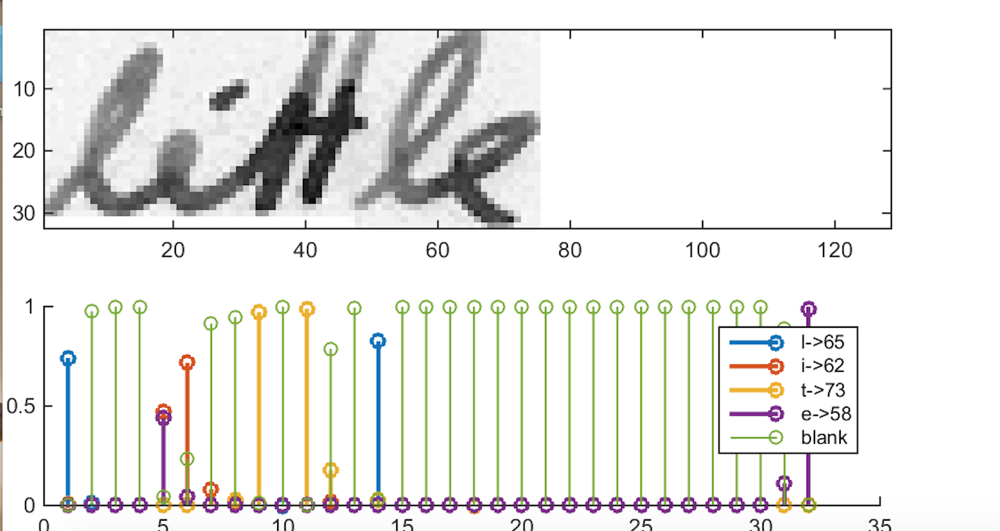

# Handwritten Text Recognition with TensorFlow

## Introduction

Hand Writing Recognition is one of significant applications of machine learning. Post services for example use this technology to sort and deliver our packages. In this simple project we recommend using a pre-trained neural network (Transfer Learning) to recognize text written by hand. You need a lot of data if you want to use/train CNN or RNN. Transfer learning bust the need for a large amount of data. The pre-trained model then can be fine-tunded for the task at hand. 

Handwritten Text Recognition (HTR) system implemented with TensorFlow (TF) and trained on the IAM off-line HTR dataset.
This Neural Network (NN) model recognizes the text contained in the images of segmented words as shown in the illustration below.
As these word-images are smaller than images of complete text-lines, the NN can be kept small and training on the CPU is feasible.
3/4 of the words from the validation-set are correctly recognized and the character error rate is around 10%.


## Command line arguments

* `--train`: train the NN, details see below.
* `--validate`: validate the NN, details see below.
* `--beamsearch`: use vanilla beam search decoding (better, but slower) instead of best path decoding.
* `--wordbeamsearch`: use word beam search decoding (only outputs words contained in a dictionary) instead of best path decoding. This is a custom TF operation and must be compiled from source, more information see corresponding section below. It should **not** be used when training the NN.

## Requirements
* python                    3.5.5
* numpy                     1.15.2 
* opencv-python             4.0.0.21
* tensorflow                1.13.1
* editdistance              0.5.3
* Keras-Applications        1.0.7      
* Keras-Preprocessing       1.0.9

## Environment Setup 
We recommend using Anaconda for running the script. Run the following command on conda shell to create a new environment with all the required packages. 

1. conda create -n DNN python=3.5
2. source activate DNN
3. conda install pandas numpy scipy jupyter cython 
3. pip install tensorflow 
4. pip install opencv-python
5. pip install editdistance

## Datasets
### IAM dataset
The data-loader expects the IAM dataset \[\3]. 
The model can work with other type of datasets as well. Either convert your dataset to the IAM format (look at words.txt and the corresponding directory structure) or necessary modifications to the class DataLoader will be necessary according to your dataset format. 

## Model Overview
We use a NN for our task. It consists of convolutional NN (CNN) layers, recurrent NN (RNN) layers and a final Connectionist Temporal Classification (CTC) layer. 
The following Fig shows an overview of our HTR system.


The NN written as a mathematical function which maps an image M to a character sequence (c1, c2, …).


### Operations
**CNN**: the input image is fed into the CNN layers. The network outputs a feature map (or sequence) has a size of 32×256.
**RNN**: the feature sequence contains 256 features per time-step, the RNN propagates relevant information through this sequence. The RNN output sequence is mapped to a matrix of size 32×80.<br />
**CTC**: while training the NN, the CTC is given the RNN output matrix and the ground truth text and it computes the **loss value**. 

## Run demo (On the Use of Transfer Learning)
Go to the `SimpleHTR/model/` directory and unzip the file `model.zip` (pre-trained on the IAM dataset).
Take care that the unzipped files are placed directly into the `SimpleHTR/model/` directory and not some subdirectory created by the unzip-program.
Afterwards, go to the `SimpleHTR/src/` directory and run `python main.py`.
The input image and the expected output is shown below.


```
> python main.py
Validation character error rate of saved model: 10.624916%
Init with stored values from ../model/snapshot-38
Recognized: "little"
Probability: 0.96625507
```

## Sample Output
**Top**: input image.<br />
**Bottom**: Probabilities for the characters “l”, “i”, “t”, “e” and the CTC blank label.


## Prepopulated form fields for the mobile app
Once the model is trained and validated using a comprehensive dataset, running the model on the test dataset will be pretty fast. This step will cost on the order of a few seconds for each word (**Note**: each word has a limit of 32 characters).
In this step, fields from the form will be input into the model and the model outputs the recognized text along with the probability of getting the recognized text which actually shows the performance of the model. 
Finally, the output texts will be saved into the database of our mobile app, and will be used for estimation of the risks that are going to affect the final price of the business insurance.

## References
\[1\] [Handwritten Text Recognition with TensorFlow](https://github.com/githubharald/SimpleHTR)

\[2\] [Build a Handwritten Text Recognition System using TensorFlow](https://towardsdatascience.com/2326a3487cd5)

\[3\] [Marti - The IAM-database: an English sentence database for offline handwriting recognition](http://www.fki.inf.unibe.ch/databases/iam-handwriting-database)

## License

MIT License

Copyright (c) 2012-2018 Michael Nielsen

Permission is hereby granted, free of charge, to any person obtaining
a copy of this software and associated documentation files (the
"Software"), to deal in the Software without restriction, including
without limitation the rights to use, copy, modify, merge, publish,
distribute, sublicense, and/or sell copies of the Software, and to
permit persons to whom the Software is furnished to do so, subject to
the following conditions:

The above copyright notice and this permission notice shall be
included in all copies or substantial portions of the Software.

THE SOFTWARE IS PROVIDED "AS IS", WITHOUT WARRANTY OF ANY KIND,
EXPRESS OR IMPLIED, INCLUDING BUT NOT LIMITED TO THE WARRANTIES OF
MERCHANTABILITY, FITNESS FOR A PARTICULAR PURPOSE AND
NONINFRINGEMENT. IN NO EVENT SHALL THE AUTHORS OR COPYRIGHT HOLDERS BE
LIABLE FOR ANY CLAIM, DAMAGES OR OTHER LIABILITY, WHETHER IN AN ACTION
OF CONTRACT, TORT OR OTHERWISE, ARISING FROM, OUT OF OR IN CONNECTION
WITH THE SOFTWARE OR THE USE OR OTHER DEALINGS IN THE SOFTWARE.
