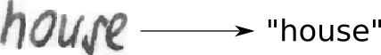

# Handwritten Text Recognition with TensorFlow

Handwritten Text Recognition (HTR) system implemented with TensorFlow (TF) and trained on the IAM off-line HTR dataset.
This Neural Network (NN) model recognizes the text contained in the images of segmented words as shown in the illustration below.

## Command line arguments

* `--train`: train the NN, details see below.
* `--validate`: validate the NN, details see below.
* `--beamsearch`: use vanilla beam search decoding (better, but slower) instead of best path decoding.
* `--wordbeamsearch`: use word beam search decoding (only outputs words contained in a dictionary) instead of best path decoding. This is a custom TF operation and must be compiled from source, more information see corresponding section below. It should **not** be used when training the NN.

## Requirements
* python         3.5.5
* numpy          1.15.2 
* opencv-python  4.0.0.21
* tensorflow     1.13.1

## Model Overview
We use a NN for our task. It consists of convolutional NN (CNN) layers, recurrent NN (RNN) layers and a final Connectionist Temporal Classification (CTC) layer. 
The following Fig shows an overview of our HTR system.

The NN written as a mathematical function which maps an image M to a character sequence (c1, c2, …).

### Operations
**CNN**: the input image is fed into the CNN layers. The network outputs a feature map (or sequence) has a size of 32×256.
**RNN**: the feature sequence contains 256 features per time-step, the RNN propagates relevant information through this sequence. The RNN output sequence is mapped to a matrix of size 32×80. 
**CTC**: while training the NN, the CTC is given the RNN output matrix and the ground truth text and it computes the **loss value**. 

## References
\[1\] [Handwritten Text Recognition with TensorFlow](https://github.com/githubharald/SimpleHTR)

\[2\] [Build a Handwritten Text Recognition System using TensorFlow](https://towardsdatascience.com/2326a3487cd5)

